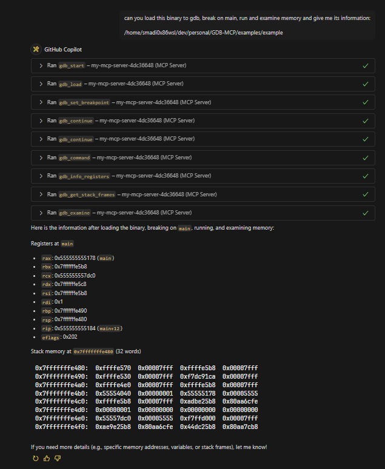

# GDB MCP Server

A Model Context Protocol (MCP) server that enables LLM clients to interact with GDB for debugging and binary analysis.

<p align="center">
  
</p>

## Quick Start

```bash
uv sync
uv venv
uv run server.py
```

## Integration

Note that you can use `uv run` to run the server.py script or you can use `uv venv` to create a virtual environment and then run the /home/youruser/dev/personal/GDB-MCP/.venv/bin/python /home/youruser/dev/personal/GDB-MCP/server.py.

### Claude Desktop

Add to your `claude_desktop_config.json`:

```json
{
  "mcpServers": {
    "gdb": {
      "command": "uv",
      "args": ["run", "/home/youruser/dev/personal/GDB-MCP/server.py"],
      "disabled": false
    }
  }
}
```

### VSCode Copilot

If you're using WSL:

```json
 "mcp": {
    "servers": {
      "my-mcp-server-4dc36648": {
        "type": "stdio",
        "command": "wsl",
        "args": [
          "/home/youruser/dev/personal/GDB-MCP/.venv/bin/python",
          "/home/youruser/dev/personal/GDB-MCP/server.py"
        ]
      }
    }
  }
```

If you're not using WSL:

```json
  "mcp": {
    "servers": {
      "my-mcp-server-db89eee1": {
        "type": "stdio",
        "command": "/home/youruser/dev/personal/GDB-MCP/.venv/bin/python",
        "args": ["/home/youruser/dev/personal/GDB-MCP/server.py"]
      }
    }
  }
```

## Available Tools

### Session Management

- `gdb_start()` - Start new GDB session
- `gdb_terminate(session_id)` - Terminate session
- `gdb_list_sessions()` - List active sessions

### Program Loading

- `gdb_load(session_id, program_path)` - Load program
- `gdb_attach(session_id, pid)` - Attach to process
- `gdb_load_core(session_id, core_file)` - Load core dump

### Execution Control

- `gdb_continue(session_id)`: Continue execution
- `gdb_step(session_id)`: Step into functions
- `gdb_next(session_id)`: Step over functions
- `gdb_finish(session_id)`: Finish current function

### Debugging

- `gdb_set_breakpoint(session_id, location)`: Set breakpoint
- `gdb_backtrace(session_id)`: Show call stack
- `gdb_print(session_id, expression)`: Print expression
- `gdb_examine(session_id, address)`: Examine memory
- `gdb_info_registers(session_id)`: Show registers

### Advanced Analysis

- `gdb_disassemble_function(session_id, function_name)`: Disassemble function
- `gdb_disassemble_around_pc(session_id, count)`: Disassemble around PC
- `gdb_get_local_variables(session_id)`: Get local variables
- `gdb_get_stack_frames(session_id)`: Get stack information
- `gdb_get_register_values(session_id)`: Get register values
- `gdb_read_memory_bytes(session_id, address, count)`: Read memory
- `gdb_get_thread_info(session_id)`: Get thread information
- `gdb_get_breakpoint_list(session_id)`: List breakpoints
- `gdb_set_watchpoint(session_id, expression)`: Set watchpoint
- `gdb_get_symbol_info(session_id, symbol)`: Get symbol info

### General

- `gdb_command(session_id, command)`: Execute any GDB command

## Testing

```bash
uv run python run-tests.py --check-deps
uv run python run-tests.py --type all
```

## Examples

Check the `examples` directory for example prompts.

## License

This project is licensed under the GNU Version 3.0 License, see the LICENSE file for details.
