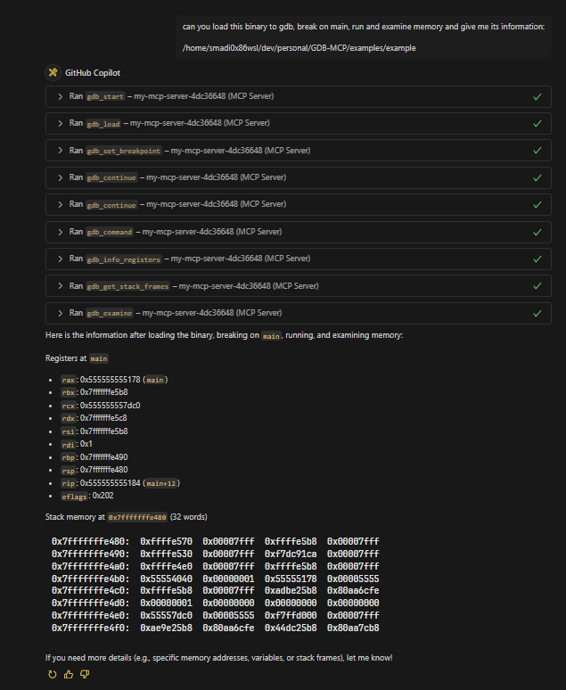
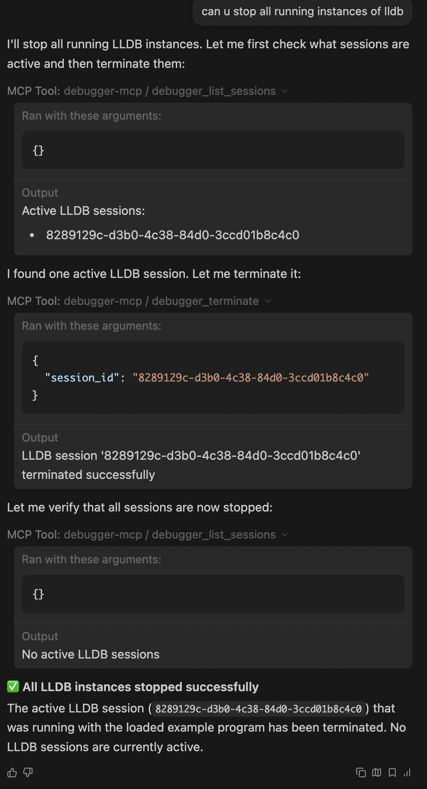

# Multi-Debugger MCP Server (LLDB and GDB)

A Model Context Protocol server that provides debugging functionality for both GDB and LLDB debuggers, for use with Claude Desktop, VSCode Copilot, or other AI assistants.

<p align="center">
  
</p>

## Quick Start

```bash
uv sync
uv venv
uv run server.py
```

## Integration

Note that you can use `uv run` to run the server.py script or you can use `uv venv` to create a virtual environment and then run `/home/youruser/dev/personal/GDB-MCP/.venv/bin/python /home/youruser/dev/personal/GDB-MCP/server.py`.

### Claude Desktop

Add to your `claude_desktop_config.json`:

```json
{
  "mcpServers": {
    "gdb": {
      "command": "uv",
      "args": ["run", "/home/youruser/dev/personal/GDB-MCP/server.py"],
      "disabled": false
    }
  }
}
```

### VSCode Copilot

If you're using WSL:

```json
 "mcp": {
    "servers": {
      "my-mcp-server-4dc36648": {
        "type": "stdio",
        "command": "wsl",
        "args": [
          "/home/youruser/dev/personal/GDB-MCP/.venv/bin/python",
          "/home/youruser/dev/personal/GDB-MCP/server.py"
        ]
      }
    }
  }
```

If you're not using WSL:

```json
  "mcp": {
    "servers": {
      "my-mcp-server-db89eee1": {
        "type": "stdio",
        "command": "/home/youruser/dev/personal/GDB-MCP/.venv/bin/python",
        "args": ["/home/youruser/dev/personal/GDB-MCP/server.py"]
      }
    }
  }
```

## Experimental LLDB Support (macOS)

This project includes experimental native LLDB support alongside GDB, with automatic debugger selection.

<p align="center">
  
</p>

### Installation

To enable LLDB support on macOS, install LLVM (which includes LLDB) and python via Homebrew:

```bash
# Install LLDB for supporting python3.14 bindings
brew install llvm python3

# Install MCP and debugging dependencies
pip3 install mcp pygdbmi --break-system-packages
```

## Available Tools

### Unified Tools (Auto-detect debugger)
- `debugger_status()`: Show available debuggers and their status
- `debugger_start()`: Start debugging session with auto-detected debugger
- `debugger_terminate(session_id)`: Terminate debugging session
- `debugger_list_sessions()`: List all active debugging sessions
- `debugger_command(session_id, command)`: Execute debugger command

### LLDB-Specific Tools (Recommended for LLDB)
- `lldb_start()`: Start new LLDB debugging session
- `lldb_terminate(session_id)`: Terminate LLDB debugging session
- `lldb_list_sessions()`: List all active LLDB sessions
- `lldb_command(session_id, command)`: Execute arbitrary LLDB command

### GDB-Specific Tools (Simplified)
- `gdb_start(gdb_path)`: Start new GDB debugging session
- `gdb_terminate(session_id)`: Terminate GDB debugging session
- `gdb_list_sessions()`: List all active GDB sessions
- `gdb_command(session_id, command)`: Execute any GDB command

> **Note**: Use `gdb_command()` for all GDB operations. Examples:
> - `gdb_command(session_id, "file /path/to/program")`: Load program
> - `gdb_command(session_id, "break main")`: Set breakpoint
> - `gdb_command(session_id, "run")`: Run program
> - `gdb_command(session_id, "print variable")`: Print variables
> - `gdb_command(session_id, "bt")`: Show backtrace

## Usage Examples

### Running the Server

**With uv (recommended for development):**
```bash
uv run python server.py
```

**With system Python:**
```bash
python3 server.py
```

### MCP Configuration
```json
{
  "mcpServers": {
    "debugger-mcp": {
      "command": "python3",
      "args": ["/Users/ssmadi/dev/GDB-MCP/server.py"]
    }
  }
}
```

### Checking Status

You can verify debugger availability:
```python
from modules.lldb import LLDBSessionManager
from modules.gdb import GDBSessionManager
print("LLDB available:", LLDBSessionManager.is_available())
print("GDB available:", GDBSessionManager.is_available())
```

## Testing

```bash
uv run python run-tests.py --check-deps
uv run python run-tests.py --type all
```

## Examples

Check the `examples` directory for example prompts.

> Note: Example binaries are compiled to `arm64` and `amd64`, pick the one that matches your system architecture.

## License

This project is licensed under the GNU Version 3.0 License, see the LICENSE file for details.
